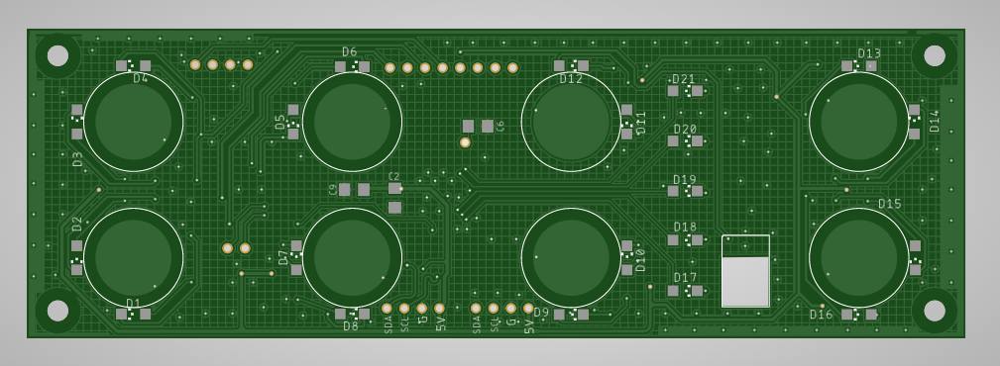
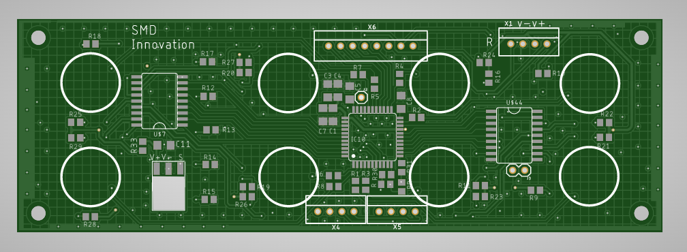
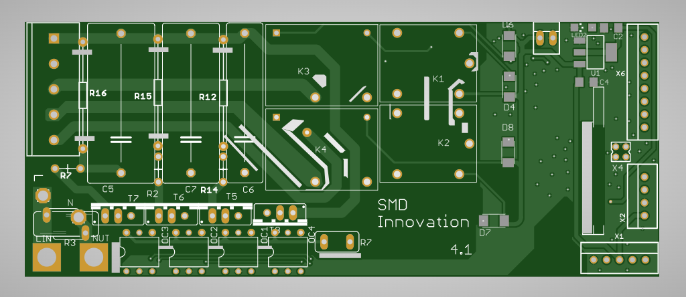
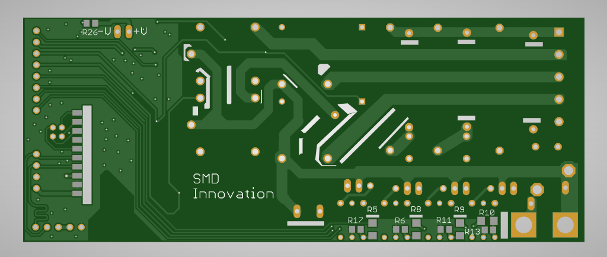
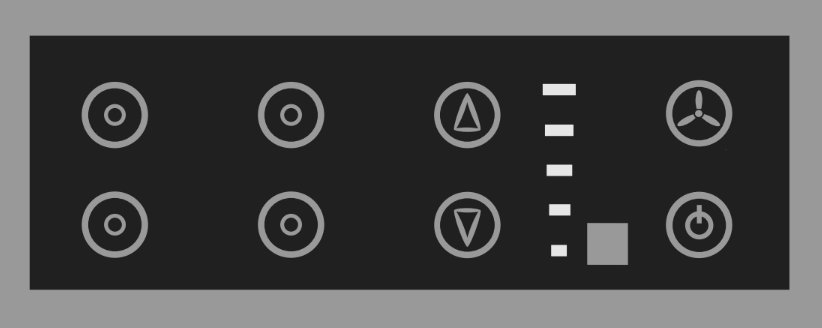

# Home Automation System
## What is Home Automation?
Home automation, often referred to as smart home technology, involves the automation of household activities through various control systems. This includes the monitoring and control of home attributes such as lighting, climate, entertainment systems, and appliances. Additionally, home automation encompasses security features like access control and alarm systems. When connected to the Internet, these devices become integral components of the Internet of Things (IoT).

## Project Aim
The objective of our Smart Module is to provide a comprehensive solution for controlling home electronic appliances using a smartphone, touch control, IR remote, and voice assistants like Alexa and Google Assistant.

## Modes of Operation
1. Touch Control: Utilizes a Cypress capacitive touch sensor to detect user touch inputs and respond based on the previous state of the relay.

2. Voice Command: Voice commands are facilitated through Alexa, which publishes MQTT messages. The ESP8266 module subscribes to these topics to receive the messages. Communication between the Cypress chip and ESP8266 occurs via I2C, enabling the system to react appropriately.

3. IR Remote: The ESP8266 decodes input from an IR remote and sends commands to the Cypress chip via I2C communication. The Cypress chip processes these commands to control the relays.

4. Smartphone: A smartphone app publishes MQTT messages that the ESP8266 module subscribes to. These messages are communicated to the Cypress chip through I2C, enabling the system to control the relays based on the received commands.

This project demonstrates the integration of various modern technologies to create a versatile and user-friendly home automation system.

## Images
Touch pad top side           |  Touch pad bottom side
:-------------------------:|:-------------------------:
  |  

Power base top side           |  Power base bottom side
:-------------------------:|:-------------------------:
  |  

Front Cover      
| :-------------------------:|
|   |

